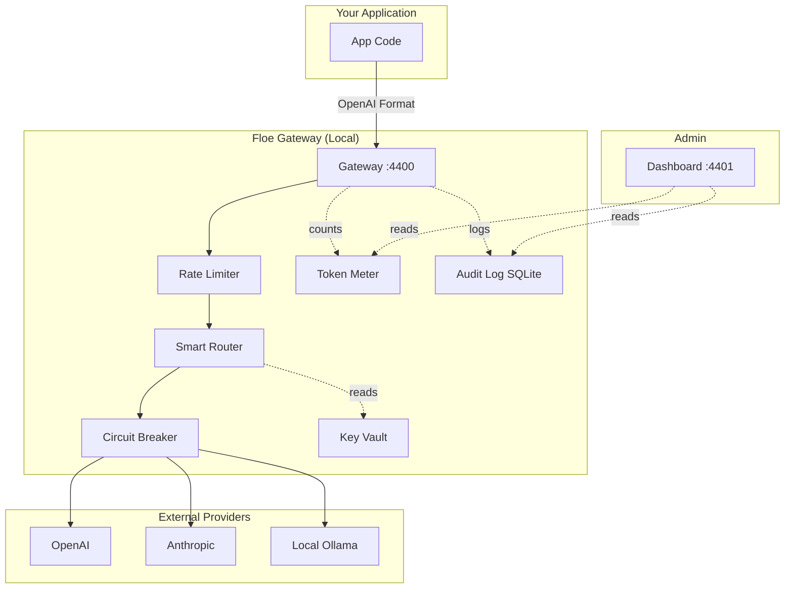

# 🧊 Floe
### One binary. Every model. Total control.

[](https://opensource.org/licenses/Apache-2.0)
[](https://goreportcard.com/report/github.com/floe-dev/floe)
[](https://github.com/floe-dev/floe/actions)
[](https://discord.gg/floe-dev)

---

## 🛑 The Problem

You're juggling 5 AI providers, 5 API keys, 5 different downtime retry strategies, and you have **zero visibility** into your actual token costs until the end of the month. When an provider goes down, your app goes down.

## 💡 The Solution

**Floe** is a single, zero-dependency Go binary (~12 MB) that acts as a local gateway, router, and orchestrator for all your AI workloads.

### 30-Second Demo
*(Imagine an embedded terminal recording here where `floe demo` is run, instantly opening a dashboard without any API keys)*

---

## ⚡ Quickstart

Install Floe in one line:

```sh
curl -sSL https://get.floe.dev | sh
```
*(Alternative installs: `go install`, `brew install`, `docker run`)*

Run the interactive, zero-config demo (no API keys required):

```sh
floe demo
```

To configure for production:

1. `floe init` (generates `floe.yaml`)
2. Edit `floe.yaml` with your provider keys.
3. `floe start` → Dashboard available at http://localhost:4401

---

## 🔥 Key Features

- 🔌 **Unified API:** Drop-in replacement for the OpenAI `/v1/chat/completions` endpoint. Send requests to Floe, and it will translate/route them to Anthropic, Ollama, vLLM, or Mistral transparently.
- 🛡️ **Circuit Breaker:** If a provider hallucinates 500 errors, Floe instantly fails-over to your secondary provider in `<50ms`.
- 💰 **Budget Metering:** Set a $50 hard limit for your side-project. Floe stops routing requests when you hit it.
- 📊 **Local Dashboard:** A stunning Next.js UI (<180 KB bundle) to view latency, costs, and token usage in real-time.
- 🔒 **Paranoid Security:** Your API keys are encrypted on disk (AES-256-GCM). Floe runs as a non-root user, drops all Docker capabilities, and evaluates YAML workflows in a restricted, no-exec sandbox.
- 🗄️ **Data Sovereignty:** 100% of your request/response logs are stored locally in SQLite. Your data never bounces through a third-party gateway SaaS.

---

## 🏗️ Architecture



---

## ⚖️ Benchmarks vs Direct API

| Metric | Direct to OpenAI | Via Floe (Local) |
|---|---|---|
| Routing Overhead | N/A | **0.8ms** |
| Memory Usage | N/A | **< 35 MB** |
| Circuit Break Failover | Manual / Application logic | **< 5ms** |
| API Key Exposure | Application ENV | **Encrypted Vault** |

---

## 🚫 Limitations & Honesty

At Floe, we believe in engineering transparency. Here is what Floe **does not** do:

1. **Floe is not a model host.** It relies on external APIs or local instances like Ollama/vLLM.
2. **Floe does not support embeddings yet.** V1 focuses entirely on `/chat/completions` and SSE streams.
3. No semantic caching (yet). If you send the same prompt twice, you pay twice.

---

## 🤝 Contributing

We want to hit 5,000 stars and become the default AI gateway for local development. We need your help!

Please see our [CONTRIBUTING.md](CONTRIBUTING.md) to understand our architecture, get your local dev environment running (`make dev`), and submit your first PR.

## 📄 License

Apache 2.0. See [LICENSE](LICENSE) for details.
