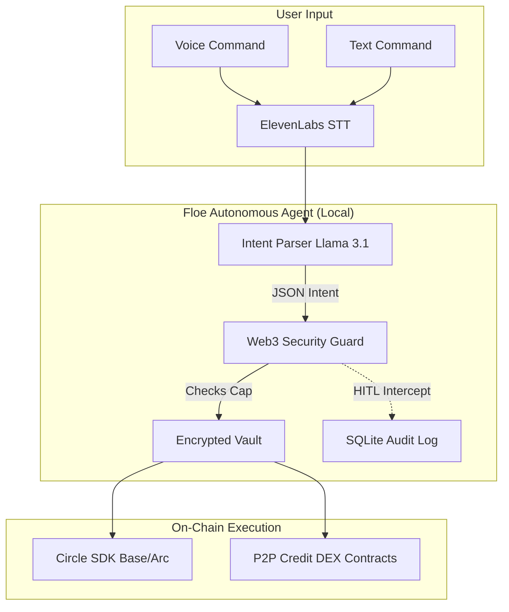

# 🤖 Floe — The First Autonomous AI Agent for Web3 Finance


**Floe** is an open-source, autonomous AI agent that manages Web3 payments, subscriptions, and P2P lending on your behalf. Powered by **Llama 3.1** (via Cloudflare Workers AI) and the **Circle CCTP SDK**, Floe turns your voice or text commands into secure, on-chain USDC transactions.

### *"Hey Floe, pay my 500 USDC server bill to DigitalOcean."*
*(Insert Interactive Voice-to-Text -> Execution Demo GIF here)*

---

## 🛑 The Problem
Right now, interacting with Web3 finance is entirely manual. You have to sign every transaction, bridge tokens manually, and remember to pay crypto subscriptions. If you try to give an AI agent access to your wallet, you risk it hallucinating and draining your funds.

## 💡 The Solution
Floe is a **Hardened Autonomous Agent**. It runs entirely locally on your machine via a single Docker container.

- **🎙️ Voice & Text Intents:** Integrated with ElevenLabs and Llama 3.1 to flawlessly parse natural language into strict JSON transaction intents.
- **💸 Cross-Chain USDC:** Native integration with Circle CCTP to execute payments seamlessly on Arc Testnet (and mainnet).
- **🏦 Built-in Credit DEX:** Floe agents autonomously match with each other on our P2P Smart Contracts to lend or borrow USDC to cover immediate subscription shortfalls.

---

## 🛡️ Security First (How we prevent the AI from stealing your money)

We engineered Floe with **Paranoid Security**. The AI never has unchecked access to your private keys.

1. **Hard Spending Caps:** You hard-code a `MaxDailyUSDC` limit in the Go backend. The Llama 3.1 agent physically cannot bypass this.
2. **Human-in-the-Loop (HITL):** Transactions above your defined threshold (e.g., >$100) are intercepted by the `Web3Guard` and sent to your phone/CLI for explicit approval before signing.
3. **No Code Execution:** Unlike early AI agents (re: CVE-2026-25253), Floe's intent parser uses a strict JSON schema. It *cannot* execute arbitrary shell scripts or Python code.
4. **Encrypted Vault:** Your Circle API keys and Wallet PINs are AES-256-GCM encrypted on disk.

---

## ⚡ Quickstart (Zero-Config Local Run)

Run the autonomous agent, the SQLite audit database, and the approval dashboard in a single command:

```bash
curl -sSL https://get.floe.dev/agent | sh
```

Or using Docker Compose:

```bash
git clone https://github.com/floe-dev/floe.git
cd floe
# Add your Cloudflare/Circle keys to .env
docker-compose up -d
```

---

## 🏗️ Architecture



---

## 🤝 Contributing & Smart Contracts

We need help expanding to more chains and adding support for DeFi protocols! 
Our P2P Credit DEX smart contracts are located in `./contracts/` and are fully tested via Foundry.

1. `make dev-agent` to run the Go backend.
2. `cd contracts && forge test` to run the Solidity suite.

See [CONTRIBUTING.md](CONTRIBUTING.md) for full details.

## 📄 License
Apache 2.0.
